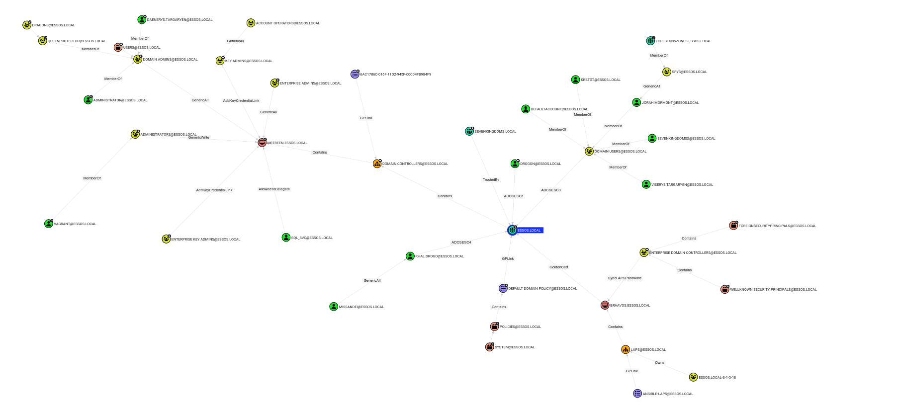
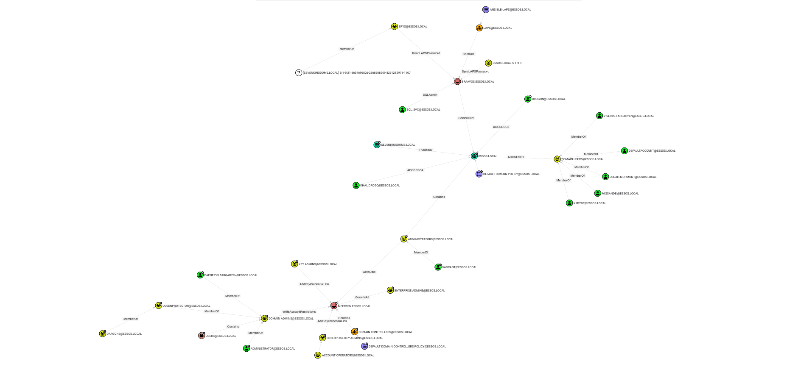

# Changelog

## v2.4.1

### Date
`2025/10/21`

### Summary

Fix issue [#16](https://github.com/g0h4n/RustHound-CE/issues/16) the [users.rs](https://github.com/g0h4n/RustHound-CE/blob/main/src/objects/user.rs#L186) code panic when trying to split on "/" if not present.
Now fix in version 2.4.1 in main branch.

**Rollback to version 2.4.0** and push PTH version into specific branch: [feat/ntlm-support](https://github.com/g0h4n/RustHound-CE/tree/feat/ntlm-support) I can't validate the pull request in the main branch because I can't publish it on [crates.io](crates.io) if ldap3 don't implement the feature ntlm create by [z-jxy](https://github.com/z-jxy).

The branch [feat/ntlm-support](https://github.com/g0h4n/RustHound-CE/tree/feat/ntlm-support) introduces the new `-H`,`--ldapntlmhash` options, enabling NTLM authentication using NT hash for pass the hash.
All information regarding the code changes can be found in the original pull request: [#17](https://github.com/g0h4n/RustHound-CE/pull/17)
Big thanks to [z-jxy](https://github.com/z-jxy) for the excellent work and for implementing this much-needed feature, as requested in issue [#5](https://github.com/g0h4n/RustHound-CE/issues/5)

## v2.4.0

### Date
`2025/06/27`

### Summary

This release introduces the new `--cache`,`--cache-buffer`,`--resume` features, allowing LDAP dump results to be store and load from disk instead of in memory, making it possible to handle much larger datasets with significantly lower RAM usage (saving approximately 70% of memory at peak usage). More informations how to use disk intead of memory in the help section here: [Using disk instead of memory](https://github.com/g0h4n/RustHound-CE/blob/main/HELP.md#using-disk-instead-of-memory)

All information regarding the code changes can be found in the original pull request: [#14](https://github.com/g0h4n/RustHound-CE/pull/14)

Big thanks to [z-jxy](https://github.com/z-jxy) for the excellent work and for implementing this much-needed feature, as requested in issue #[7](https://github.com/g0h4n/RustHound-CE/issues/7)

## v2.3.7

### Date
`2025/06/24`

### Summary

Issue #[13](https://github.com/g0h4n/RustHound-CE/issues/13) fixed.
"Group members are no longer collected correctly."
Fixed a logic error: used `if value.is_empty()` instead of `if !value.is_empty()`

## v2.3.6

### Date
`2025/06/23`

### Summary

This version includes a complete code review to apply improvements suggested by [Clippy](https://doc.rust-lang.org/clippy/usage.html) and contributions from [z-jxy](https://github.com/z-jxy). It addresses potential logic issues, removes dead code, and resolves an infinite recursion bug in the Debug implementation.

## v2.3.5

### Date
`2025/06/19`

### Summary

Issue #[10](https://github.com/g0h4n/RustHound-CE/issues/10) fixed.

The problem was caused by the ACEs from `msDS-GroupMSAMembership` overwriting those from `nTSecurityDescriptor`, due to a reassignment of `self.aces` instead of appending to it on gMSA users.

The fix ensures that ACEs from both attributes are now properly merged. As a result, users and groups with `ReadGMSAPassword` permissions on gMSA accounts are correctly captured and included in the final output. Thanks to [0xdf223](https://github.com/0xdf223) for reporting.

## v2.3.4

### Date
`2025/02/13`

### Summary

Merge pull request #[8](https://github.com/g0h4n/RustHound-CE/pull/8) to add a couple more computer node attributes. Thanks [spyr0](https://github.com/spyr0-sec)

## v2.3.3

### Date
`2025/01/28`

### Summary

Merge pull request #[6](https://github.com/g0h4n/RustHound-CE/pull/6) to add argument `--ldap-filter` to change the ldap-filter to use instead of the default `(objectClass=*)`. Thanks [Mayfly277](https://github.com/Mayfly277)

## v2.3.2

### Date
`2025/01/14`

### Summary

The issue where a group had `ActiveDirectoryRights:Self` with a SID mapped to it, theoretically allowing a user to add themselves to the group, has been fixed. Thanks to @shyam0904a for identifying and fixing this issue! https://github.com/g0h4n/RustHound-CE/pull/4

## v2.3.1

### Date
`2025/01/05`

### Summary

This version fixes the issue of the lack of [WriteGPLink](https://support.bloodhoundenterprise.io/hc/en-us/articles/29117665141915-WriteGPLink) for Organization Units and [WriteSPN](https://support.bloodhoundenterprise.io/hc/en-us/articles/17222775975195-WriteSPN) for Computers.

## v2.3.0

### Date
`2024/12/28`

### Summary

The latest update introduces enhanced functionality and optimizations for handling Active Directory objects. It includes support for [IssuancePolicies](https://support.bloodhoundenterprise.io/hc/en-us/articles/26194070577691-IssuancePolicy). Fixing unconstrained delegation issues where FQDNs were replaced with SIDs to ensure compatibility with BloodHound CE. GUIDs are now properly parsed in the Windows Active Directory format, adhering to the little-endian structure, this allow to fixe all issues related to ACEs permissions. Password policy attributes from Active Directory are retrieved and associated with the domain object in domain.json. Additionally, Kerberos service ticket encryption algorithms are now extracted via the `msDS-SupportedEncryptionTypes` attribute. Finally, the code has been optimized to improve object type verification and streamline offline value replacements in `src/json/checker/common.rs`, enhancing performance and maintainability.

### Examples

*The tests were conducted on Mayfly's GOAD lab environment.*

> Shortest paths to systems trusted for unconstrained delegation

```cypher
MATCH p=shortestPath((n)-[:Owns|GenericAll|GenericWrite|WriteOwner|WriteDacl|MemberOf|ForceChangePassword|AllExtendedRights|AddMember|HasSession|Contains|GPLink|AllowedToDelegate|TrustedBy|AllowedToAct|AdminTo|CanPSRemote|CanRDP|ExecuteDCOM|HasSIDHistory|AddSelf|DCSync|ReadLAPSPassword|ReadGMSAPassword|DumpSMSAPassword|SQLAdmin|AddAllowedToAct|WriteSPN|AddKeyCredentialLink|SyncLAPSPassword|WriteAccountRestrictions|WriteGPLink|GoldenCert|ADCSESC1|ADCSESC3|ADCSESC4|ADCSESC5|ADCSESC6a|ADCSESC6b|ADCSESC7|ADCSESC9a|ADCSESC9b|ADCSESC10a|ADCSESC10b|ADCSESC13|DCFor|SyncedToEntraUser*1..]->(m:Computer))
WHERE m.unconstraineddelegation = true AND n<>m
RETURN p
LIMIT 1000
```

#### RustHound-CE - v2.3.0

```bash
rusthound-ce.exe -c All -d ESSOS.local -u vagrant -p vagrant -z
```



#### SharpHound - v2.5.9.0

```bash
SharpHound.exe -c All -d ESSOS.local --ldapusername vagrant --ldappassword vagrant
```



